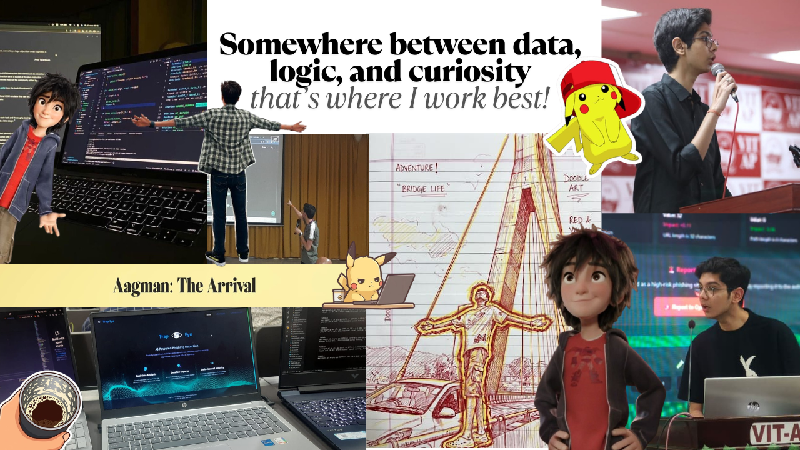

Hey there! 👋

I'm a Computer Science major student, who enjoys turning ideas into code (and occasionally bugs into life lessons). I'm passionate about technology, innovation, and the kind of entrepreneurship that actually solves real problems.

Right now, I'm building my toolkit across software development, data structures & algorithms, data/business analytics, business intelligence, and a bit of everything that helps me understand how tech and business really connect behind the scenes.

I like working on things that are practical, slightly challenging, and make me go "okay wait… this is actually cool."

I'm always up for connecting with people who are building, learning, or just figuring things out — whether it's for internships, collaborations, or interesting conversations.

Outside of tech, I run on coffee ☕, random creative phases, and a constant urge to explore new places!

If you're building something cool, I'm probably already interested 🚀

  

# 🌐 Socials:
 
 
 
 

# 💻 Tech Stack:
                             

  

## ⚙️ Aagman'S Operating System
Role: Builder   | Goal: Impact  | Interest: Data | Mode: Learning + Building

  

> I’d rather build something imperfect than understand everything perfectly.
